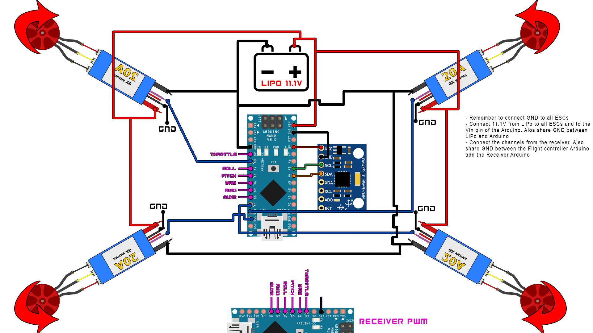

During my Junior year of High School, my engineering class had an opportunity to build our own drones from a drone kit and program it using Arduino. This was one of my first experiences when it comes to coding and it was a lot of fun. Not only was it an experience with coding, but also with mechanical, software, and electrical components. The goal of this project was to build a drone using Arduino as well as a drone kit from Arduino. This project allowed us high school students to experience building something from scratch as well as coding. 

This project was also my first experience is running into multiple coding errors. My group and I would spend time outside of class to work on the code and I began to understood how much time and effort coding takes. It took roughly 2 weeks for my group to get the drone to work after multiple coding errors and finally getting our drone to fly was very satisfactory. We went to the baseball field of our school and after many attempts to get it to fly, we got it to fly effectively.
